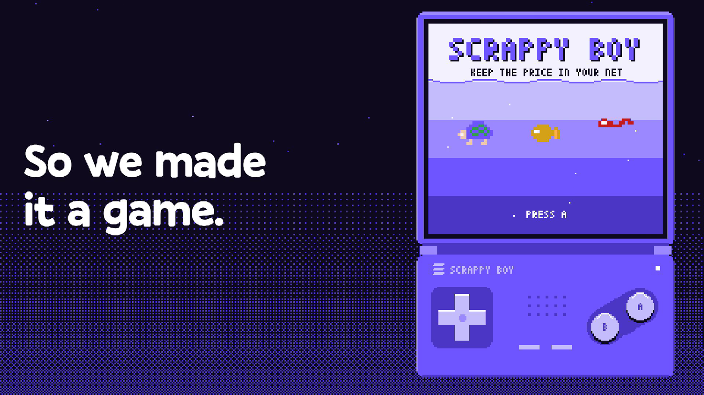

# SCRAPPY BOY

**A Game Boy where every button is a Solana trade.**

Crypto is hard, so we made it a game. Robinhood made trading simple by removing screens.
We removed all of them: four buttons, a d-pad, and a pixel screen. Built for Solana Mobile
and the Seeker.

[](https://scrappypet.vercel.app/scrappyboy)

**Play it:** [scrappypet.vercel.app/scrappyboy](https://scrappypet.vercel.app/scrappyboy) · add `?net=devnet` to try every trade at no cost
**Hackathons:** CLOCK IN (Solana Mobile) · Colosseum + Superteam India, 2026

## The problem

A new user who opens a Solana app meets slippage, tick ranges, priority fees, seed phrases
and impermanent loss before they have done one thing. Most leave. The actions underneath are
simple: buy, sell, put money where trades happen, take it back. The words are the wall.

## What we built

One handheld, three cartridges. Every button press is an action on Solana, and the screen
never uses the jargon.

| Cartridge | What the player does | What happens on chain | Network |
|---|---|---|---|
| **PLAY NOW** | Keeps a creature inside a net while it rides the live SOL price | Nothing. Points only. This teaches the controls, and the skill is the one a liquidity provider needs | none |
| **DEEP NET** | Casts a net into the sea, collects coins, pulls the net in | Opens an Orca Whirlpool position, harvests its fees, closes it | devnet |
| **MEME DASH** | Picks a coin, presses A to buy and B to sell | A Jupiter swap each way, approved in the player's own wallet. A safety net at -8% and a treasure line at +15% sell for you while the screen is open | mainnet |

On top of MEME DASH: **trade duels**. Finish a trade, send a link, and a friend trades the
same coin to beat your result. Everyone trades their own money. Nothing is staked between
players and nothing is paid to the winner.

## Why it is different

- **The interface is the idea.** Not a simpler trading app: a console. Coin lists, charts
  and positions are drawn by our own pixel engine, 160x144, 16 colours, with a chiptune synth.
- **Playing is learning.** After a round, the results screen tells you that keeping the price
  in your net is what liquidity providing is. Then one press does it with an Orca position.
- **Your keys, your coins.** Trades are signed by your wallet and the coins stay in it.
  A device-only play key signs the free devnet moves so the game never stops for a popup.
- **No bets.** Points are never money, and duels have no pot.

## Built for Seeker

- Android app for the Solana dApp Store (`apps/android`, a Trusted Web Activity)
- Wallet approval through Mobile Wallet Adapter (`@solana-mobile/wallet-standard-mobile`)
- SKR is the first coin in MEME DASH, a trade can be sized in SKR, and SKR holders get a
  SEEKER tag on their save card
- Laid out for a phone held upright: the console fills the screen and the plastic buttons
  are the touch targets

## What is on chain

- **Orca Whirlpools** (`@orca-so/whirlpools`): open, harvest, increase and close positions
- **Jupiter** swap and price APIs: every MEME DASH buy and sell
- **`scrappy_arcade`**, our Anchor program: a save card PDA per player (best, last, plays)
  and link-battle PDAs, with MagicBlock session keys so a device key can write scores.
  Program ID: `6JWs3RjaawXTHvjFmFq2UxWiX8HPpxfi71WsGeLqVXm3`

Every transaction the game sends is listed under the console with a link to the explorer.

## Business

A platform fee on each MEME DASH swap, taken by Jupiter inside the swap and shown on the
trade screen. The code path is in `meme.ts` (0.5%) and stays off until the fee account is
set. At 0.5%, $1M a year in revenue is $200M a year in swap volume. Second line: cartridges.
Each new cartridge turns one more hard action (staking, lending) into a game on the same
console, and partners can sponsor one.

## Status

| | |
|---|---|
| Live | The three cartridges on the web; MEME DASH on mainnet |
| Built, on a preview | Wallet-approved trades, trade duels, saved trades across reloads, the film on the landing page, privacy and keys page |
| Built, not switched on | Swap fee |
| Next | Link battles screen, dApp Store listing, Seed Vault signing |

We have not put numbers in this README that we cannot back with chain data.

## The film

`video/` holds a 49 second film of the product. Every frame is drawn by the game's own pixel
engine and sprites, the price lines are SOL-USD and SKR-USD market data, and the soundtrack
is rendered by the console's own synth.

```bash
cd video && bun install && bun run render   # video/out/scrappy-boy.mp4
```

## Where things live

| Path | What |
|---|---|
| branch `site-classic` | **The product:** the SCRAPPY BOY web app (`apps/web`), the `scrappy_arcade` program, and the technical README |
| `video/` | The film |
| `packages/console` | The pixel console engine |
| `apps/android` | Android wrapper for Seeker |
| `docs/TIDEPOOL.md` | The spec the liquidity cartridge grew from |

Run the game:

```bash
git checkout site-classic
bun install
bun run verify     # typecheck + eslint + tests
bun run dev        # http://localhost:3000/scrappyboy
```

## Paused

Earlier directions still have code on this branch and are not the product: the Human API
(`apps/api`, `apps/mcp`, `packages/sdk`, `apps/web`, `docs/POSITIONING.md`, `docs/PRD.md`,
`docs/ARCHITECTURE.md`) and Scrappy Battles (`docs/SCRAPPY-BATTLES.md`).

## Risk

MEME DASH trades with the player's own money and they can lose it. The auto-sell lines only
work while the trade screen is open. Nothing here is financial advice.
